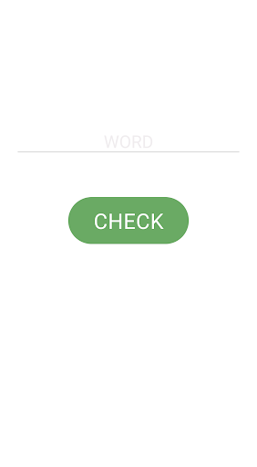
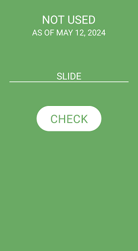
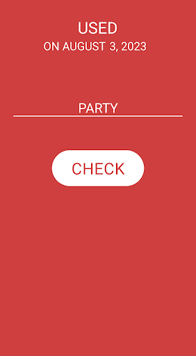

# WordleCheck

App for checking if a word has been used by Wordle in the past.
Words are not repeated in the game, meaning that this tool tells you if your word is still playable.

## Screenshots

